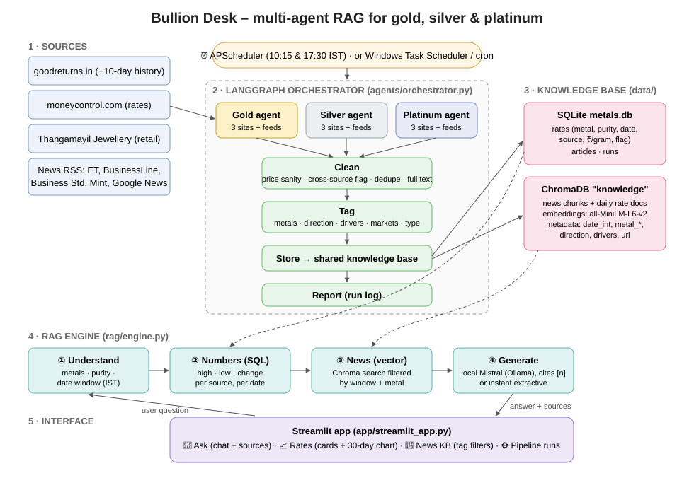

# 🪙 Bullion Desk – multi-agent RAG for gold, silver & platinum

Three agents collect **gold, silver and platinum rates** every day from **goodreturns**, **moneycontrol** and a
jeweller's website (**Thangamayil Jewellery**), plus related market news. They clean and tag everything and store it
in one shared knowledge base. A RAG chat on top answers questions like:

> *"What is the highest price in this week and how did markets react?"*

Answers are **grounded** in the stored data, **cite their sources** as [1], [2]…, and are **date-aware**: "this week",
"yesterday" and "on 2 Oct" are converted to exact Indian-time date ranges.

**No API keys are used anywhere.** Embeddings run locally (all-MiniLM-L6-v2). The optional LLM is an open-source
model (Mistral) running on your own PC through Ollama.



## Tech stack

| Part | Choice |
|---|---|
| Language | Python 3.14 |
| Agent framework | **LangGraph**: 3 metal agents run in parallel, then clean → tag → store → report |
| Sources | goodreturns.in, moneycontrol.com, thangamayil.com, plus news RSS (Economic Times, BusinessLine, Business Standard, Mint, Google News) |
| Embeddings | all-MiniLM-L6-v2 (open-source, built into ChromaDB, runs on CPU) |
| Vector DB | **ChromaDB** (local, `data/chroma`) |
| Numbers DB | SQLite (`data/metals.db`): exact prices for "highest/lowest" questions |
| LLM | Optional local **Mistral via Ollama**. Default is an instant extractive answer |
| Interface | **Streamlit** |
| Scheduling | **APScheduler** (`--schedule`) or Windows Task Scheduler / cron running `run_agents.bat` |

## Step-by-step flow

1. **Trigger.** APScheduler runs the pipeline at 10:15 and 17:30 IST (jewellers publish around 9:30–10:00). You
   can also run it by hand or from the **Run the 3 agents now** button in the app.
2. **Collect (3 agents in parallel).** Each metal has its own agent (`agents/metal_agent.py`). Every agent:
   - scrapes its metal's rate from all 3 sites (`agents/scrapers.py`). goodreturns also gives a 10-day history
     table, so the knowledge base has a full week of prices from the very first run.
   - reads the news feeds and keeps only stories that mention its metal. Noise filters drop items like
     "Platinum Industries shares" or credit-card news.
   - If one source fails, the agent logs it and carries on. If a whole agent crashes, the other two still finish.
3. **Clean** (`processing/cleaner.py`):
   - Rates: every price is converted to INR per gram. Impossible values are dropped (catches parser bugs). Duplicate
     rows are removed. A source more than 15% away from the other sources is **flagged**; for example, a jeweller's
     retail platinum price.
   - News: duplicate stories found by different agents are merged into one article with a list of metals. HTML and
     publisher suffixes are stripped. Full article text is downloaded with trafilatura.
4. **Tag** (`processing/tagger.py`). Rule-based, free and explainable. Each article gets:
   - `metals`
   - `direction` (up / down / mixed)
   - `drivers` (fed_rates, us_dollar, rupee, geopolitics, festive_demand…)
   - `markets` (mcx, comex, equities, etf, crude)
   - `type` (news / analysis_outlook / rates_update)
5. **Store** in the shared knowledge base (`kb/store.py`):
   - SQLite `rates` table: one row per metal × purity × date × source.
   - ChromaDB: news chunks of about 900 characters, plus one "daily rates" summary per metal per day. Each chunk
     has metadata `date_int`, `metal_gold/silver/platinum`, the tags and the URL.
6. **Report.** Each run's statistics (per-agent counts, errors, flags) go to the `runs` table and appear in the
   **Pipeline runs** tab.
7. **Ask** (`rag/engine.py`). For each question, the engine:
   1. **Understands** the question: which metals, which gold purity, and which date window. For example, "this week"
      means Monday to today in India time; on a Monday or Tuesday it falls back to the past 7 days.
   2. Computes the **numbers with SQL**: high, low, first, last and change per source. Prices always come from the
      database, so the LLM cannot make them up.
   3. Searches **news in ChromaDB**, filtered to the same date window and metals. If there are fewer than 3 stories,
      it widens to 14 days and says so.
   4. **Generates** the answer. The default is an instant, exact answer built from those facts. With the
      **Write with local LLM** toggle on, Mistral writes the answer under strict rules: only from the context,
      cite every claim as [n], state the dates, and say "I don't have data" when something is missing.
8. **Show.** The Streamlit app displays the answer, the date window used and the clickable sources.

## Run it

```bat
cd "Capstone2_MetalRates"
python -m venv venv
venv\Scripts\pip install -r requirements.txt
run_agents.bat                  :: collect once (about 1 minute; first run downloads the 80 MB embedding model)
start_app.bat                   :: open http://localhost:8501
venv\Scripts\python -m eval.smoke_test     :: 19 checks
```

Keep collecting every day using either of these:
- `run_agents.bat --schedule` (leave the window open; runs at `RUN_TIMES` in IST), or
- Windows Task Scheduler: a daily task that runs `run_agents.bat`.

Optional written answers: install [Ollama](https://ollama.com), run `ollama pull mistral`, then switch on
**Write with local LLM** in the app sidebar. It is slow on a CPU (about 1–4 minutes per answer).

## Cloud deployment (Streamlit Community Cloud)

The cloud disk is temporary, so **GitHub stores the knowledge base**:

1. `.github/workflows/collect.yml` runs the 3 agents on GitHub Actions at 10:15 and 17:30 IST (or on demand
   via **Actions → Collect metal rates → Run workflow**).
2. Each run unpacks `kb.zip` from the `kb-data` branch, collects, runs the smoke test and force-pushes the new
   `kb.zip` (about 2 MB, a single commit, so the repo doesn't grow).
3. On Streamlit Cloud, `kb/store.py` detects the cloud environment, downloads `kb.zip` and checks for a newer one every 10 minutes.

No secrets are needed: GitHub's built-in token saves the data, and the repo is public so the app can download
it. The local-LLM toggle is off on the cloud because there's no Ollama there, so answers are extractive.
`venv\Scripts\python -m scripts.kb_sync pull` copies the cloud data to your PC.

## Project layout

```
agents/      sources.py (URLs) · scrapers.py (3 site parsers) · metal_agent.py · orchestrator.py (LangGraph + scheduler)
processing/  cleaner.py · tagger.py
kb/          store.py (SQLite + ChromaDB)
scripts/     kb_sync.py (kb.zip pack / unpack / pull)
.github/     workflows/collect.yml (scheduled agents on GitHub Actions)
rag/         engine.py (understand → SQL → vector search → answer) · llm.py (local Ollama, no key)
app/         streamlit_app.py
eval/        smoke_test.py
docs/        architecture.svg
```

## Known limits

- Scrapers depend on each site's HTML. If a site changes its layout, that source shows 0 rates in **Pipeline runs**
  and the smoke test fails, so you notice early.
- moneycontrol blocks browser-like clients, so the agent uses a plain user agent for it.
- Google News items only carry headlines; the full-text feeds supply the "why" behind price moves.
- The rates are reference prices from public pages, not trading data. This app does not give investment advice.
